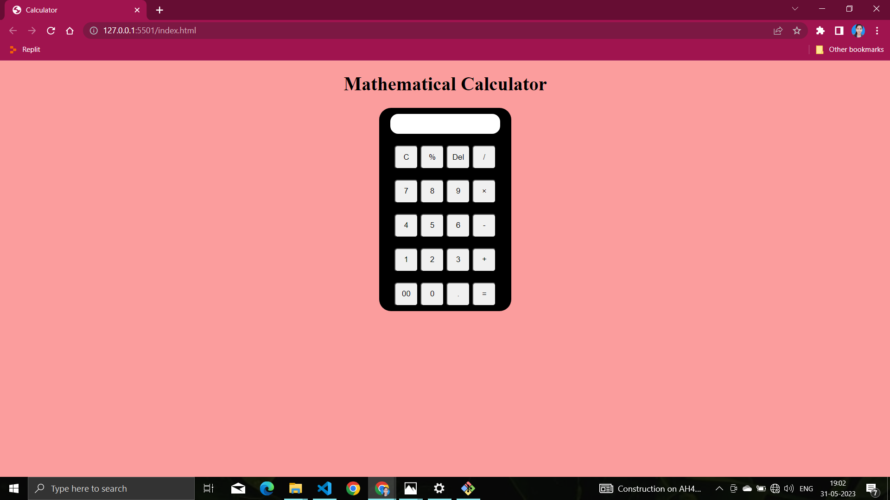
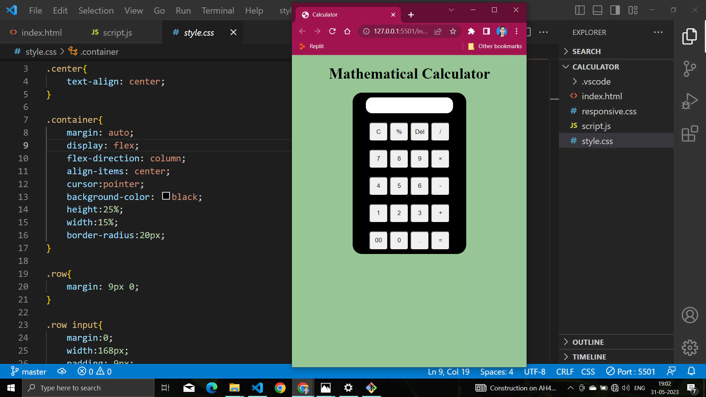
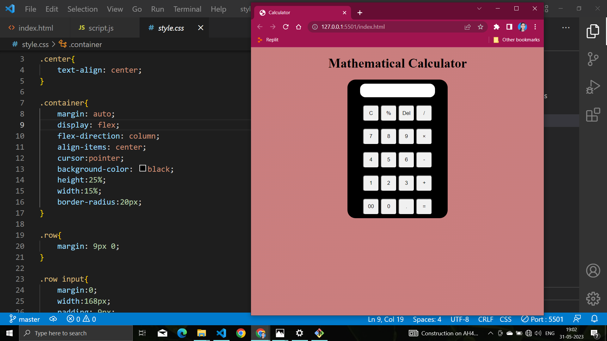

 <h1>Calculator-Uisng-HTML-CSS-JS</h1>
<ul>
        <li>Perform basic arithmetic operations: addition, subtraction, multiplication,modulus and division.</li>
        <li>Evaluate mathematical expressions using the equals (=) button.</li>
        <li>Clear the input field with the clear (C) button.</li>
        <li>Delete the last character with the delete (Del) button.</li>
        <li>Responsive design for optimal viewing and usage across different devices.</li>
        <li>Intuitive user interface for easy interaction and input.</li>
      </ul>

  
<h2>HTML:</h2> Used to structure the calculator interface and elements.

  
<h2>CSS:</h2>  Styled the calculator layout, buttons, and responsiveness.

  
<h2>JavaScript:</h2> Implemented the calculator's logic for input handling, calculations, and display .

  <h2>Usage:</h2>
<ul>
    <li>Enter numerical values by clicking the number buttons.</li>
    <li>Use the operator buttons (+, -, *, /,%) to perform arithmetic operations.</li>
    <li>Press the equals (=) button to evaluate the entered expression.</li>
    <li>Clear the input field with the clear (C) button.</li>
    <li>Delete the last character with the delete (Del) button.</li>
</ul>

<h1>Output Iamges</h1>

